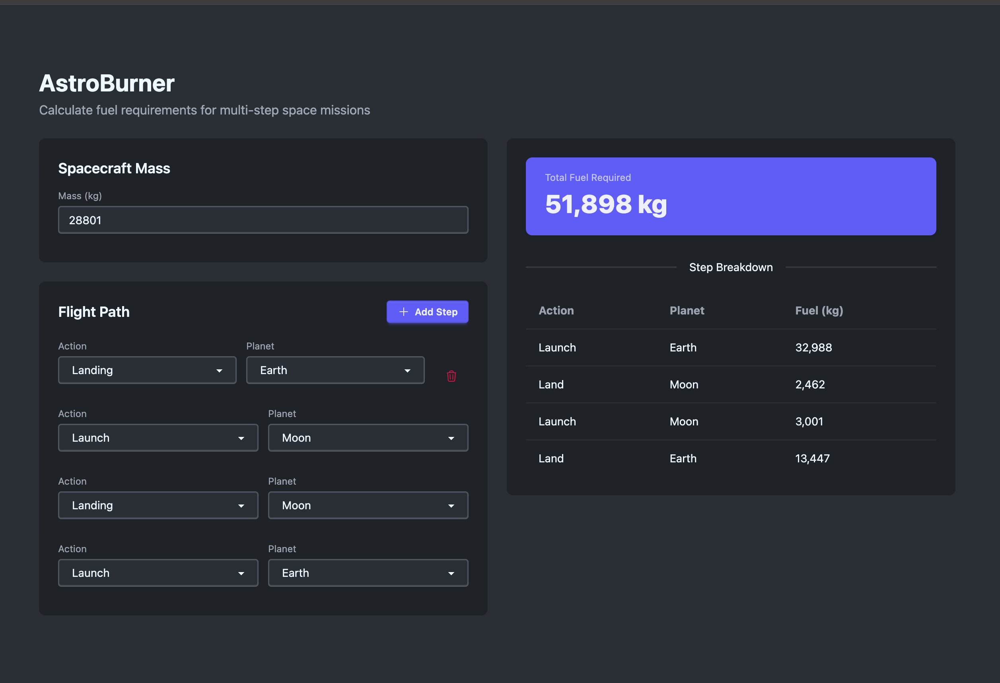

# AstroBurner



A Phoenix LiveView application for calculating spacecraft fuel requirements across multi-step flight paths.

## Web Interface

Navigate to `http://localhost:4000` to access the flight path builder:

1. Enter spacecraft mass (kg)
2. Add flight path steps — each step is a maneuver (Launch or Land) on a planet
3. Fuel requirements update in real time as you build the path
4. Results show total fuel and a per-step breakdown

**UI constraints enforced automatically:**
- Maneuvers must alternate (no two consecutive launches or landings)
- After landing on a planet, the next launch must be from the same planet
- The Add Step button is disabled until a valid mass is entered
- Only the last step can be removed

## Domain

**Fuel calculation** accounts for the fact that fuel itself has mass, so additional fuel is needed to carry the fuel. The calculation recurses until the fuel increment is zero or negative.

Formulas (result floored to integer):
- Launch: `mass × gravity × 0.042 − 33`
- Landing: `mass × gravity × 0.033 − 42`

**Multi-step paths** are computed in reverse order: each step's fuel calculation includes the weight of all fuel loaded by subsequent steps.

**Planets** store a gravitational constant (`gravity`) used in the formulas. Three planets are seeded by default:

| Planet | Gravity (m/s²) |
|--------|----------------|
| Earth  | 9.807          |
| Moon   | 1.62           |
| Mars   | 3.711          |

## Example Missions

| Mission | Path | Mass (kg) | Fuel (kg) |
|---------|------|-----------|-----------|
| Apollo 11 | Launch Earth → Land Moon → Launch Moon → Land Earth | 28,801 | 51,898 |
| Mars Mission | Launch Earth → Land Mars → Launch Mars → Land Earth | 14,606 | 33,388 |
| Passenger Ship | Launch Earth → Land Moon → Launch Moon → Land Mars → Launch Mars → Land Earth | 75,432 | 212,161 |

## Key Modules

- `AstroBurner.FlightPath` — context boundary for the web layer; multi-step calculation, per-step breakdown, constraint helpers, and planet listing
  - `calculate_total/2` — total fuel for a flight path
  - `calculate_breakdown/2` — fuel total + per-step breakdown list
  - `valid_next_maneuvers/2` — returns allowed maneuvers at a given step index
  - `required_next_planet_id/2` — returns the required planet ID after a landing, or `nil` if any planet is valid
- `AstroBurner.FuelCalculator` — pure recursive fuel calculation; takes mass (integer), `%Planet{}` struct, and maneuver (`:launch` or `:landing`)
- `AstroBurner.Planets` — planet data access (`get_planet/1`, `list_planets/0`, `get_planets_by_ids/1`, `upsert_planet!/1`)
- `AstroBurner.Planets.Planet` — Ecto schema with UUID primary key, unique name, and decimal gravity
- `AstroBurnerWeb.FlightPathLive` — LiveView UI; delegates all business logic to `FlightPath`

## Project Structure

```
lib/
├── astro_burner/
│   ├── flight_path.ex          # Context boundary — multi-step calculation + constraint helpers
│   ├── fuel_calculator.ex      # Pure recursive fuel formula (no DB)
│   ├── planets.ex              # Planet data access
│   └── planets/
│       └── planet.ex           # Ecto schema (UUID PK, name, decimal gravity)
└── astro_burner_web/
    ├── components/
    │   ├── core_components.ex  # Shared UI components (form inputs, tables, buttons)
    │   └── layouts.ex          # App and root layout wrappers
    ├── controllers/
    │   └── page_controller.ex  # Redirects / → LiveView
    ├── live/
    │   └── flight_path_live.ex # Flight path builder LiveView
    └── router.ex

test/
├── astro_burner/
│   ├── flight_path_test.exs       # FlightPath context + constraint function unit tests
│   ├── fuel_calculator_test.exs   # Pure calculation unit tests (no DB)
│   ├── planets_test.exs           # Planets context tests
│   └── planets/
│       └── planet_test.exs        # Planet schema changeset tests
├── astro_burner_web/
│   ├── controllers/
│   └── live/
│       └── flight_path_live_test.exs  # LiveView integration tests
└── support/
    ├── factory.ex    # ExMachina factories
    ├── conn_case.ex  # ConnCase helper
    └── data_case.ex  # DataCase helper (sandbox DB)
```

## Setup

```bash
mix setup        # deps + DB create + migrate + seed
mix phx.server   # start at http://localhost:4000
```

Or inside IEx:

```bash
iex -S mix phx.server
```

## Database

PostgreSQL with a single `planets` table (UUID primary key, unique name index, decimal gravity).

```bash
mix ecto.reset   # drop + recreate + migrate + seed
```

## Development

```bash
mix precommit    # compile (warnings-as-errors), format, unused deps check, tests
mix test         # run tests (auto-creates and migrates the test DB)
```

## Stack

- Elixir ~> 1.15 / Phoenix 1.8
- Phoenix LiveView 1.1 with DaisyUI v5
- Ecto + PostgreSQL (decimal gravity stored with full precision)
- Bandit HTTP server
- Tailwind CSS + esbuild
- ExMachina (test factories), Credo (linting)
